<picture>
  <source media="(prefers-color-scheme: dark)" srcset="./assets/header-dark.svg">
  
</picture>

 

Computer Systems Engineering student and freelance developer. I build **web, desktop and mobile apps**, and ship **custom Minecraft mods** (Fabric / NeoForge) for clients worldwide.

  
  
  

### Selected work

| | Project | What it is |
|:-:|---|---|
| 🛡️ | [**NatSentry**](https://github.com/Nightmare33n/NatSentry) | Android app that watches your home network and flags unknown devices joining your Wi-Fi. `Kotlin` |
| 🎾 | [**TennisWeb**](https://github.com/Nightmare33n/TennisWeb) | Platform to connect tennis players across Mexico. `JavaScript` |
| 🏝️ | [**Island Noise Param Generator**](https://github.com/Nightmare33n/Island-Noise-Param-Generator) | Tooling for tuning Minecraft world-gen density functions. `JavaScript` |
| 🧩 | [**JCEF React Template**](https://github.com/Nightmare33n/JCEF-React-Template) · [**Electron + Next.js**](https://github.com/Nightmare33n/Electron-Next.js-Template) | Starters for desktop apps with a web UI. `Java` `TypeScript` |

### Stack

More: tools & practices

 

**Modding** &nbsp; `Fabric API` `NeoForge` `Paper` `Datapacks` `World generation` 
**Tooling** &nbsp; `REST APIs` `LaTeX` `Manim` `JCEF` 
**Practices** &nbsp; `Client communication` `Project scoping` `Debugging` `Documentation`

### Now

- Building community projects across web, desktop and mobile
- Delivering client work in Minecraft mod development
- Going deeper into systems-level programming

### Recent activity

<!-- ACTIVITY:START -->
1. Oct 1 &nbsp; 🚀 Released [v0.1.2](https://github.com/Nightmare33n/DAW-releases/releases/tag/v0.1.2) of [DAW-releases](https://github.com/Nightmare33n/DAW-releases)
2. Sep 20 &nbsp; 🚀 Released [v0.14.0](https://github.com/Nightmare33n/Jelly-Go-2-releases/releases/tag/v0.14.0) of [Jelly-Go-2-releases](https://github.com/Nightmare33n/Jelly-Go-2-releases)
3. Sep 17 &nbsp; 🚀 Released [v0.9.2](https://github.com/Nightmare33n/cumulus-releases/releases/tag/v0.9.2) of [cumulus-releases](https://github.com/Nightmare33n/cumulus-releases)
<!-- ACTIVITY:END -->

↑ updated automatically every 6 hours by a [GitHub Action](./.github/workflows/activity.yml)
